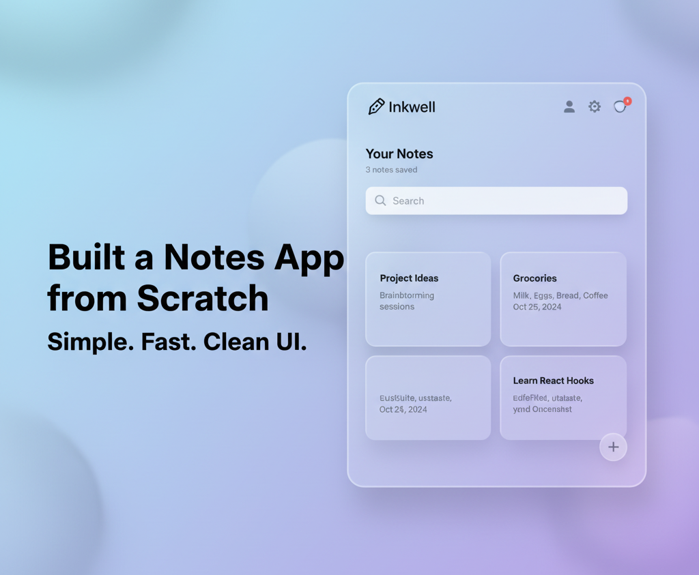
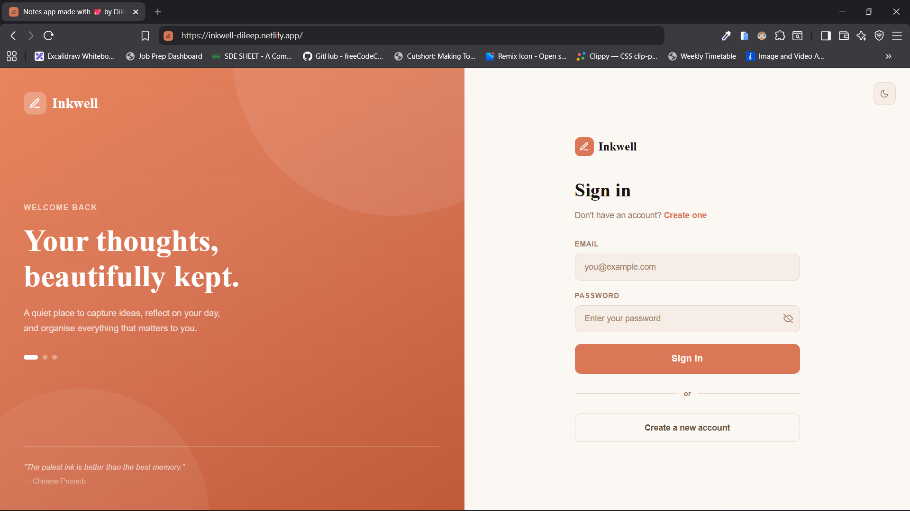
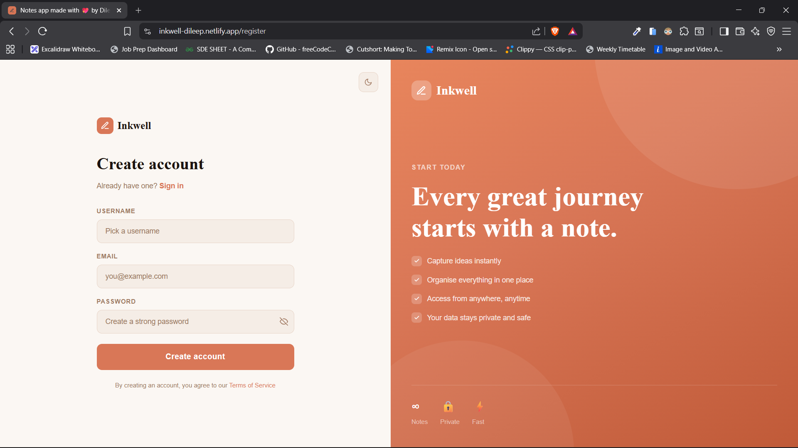
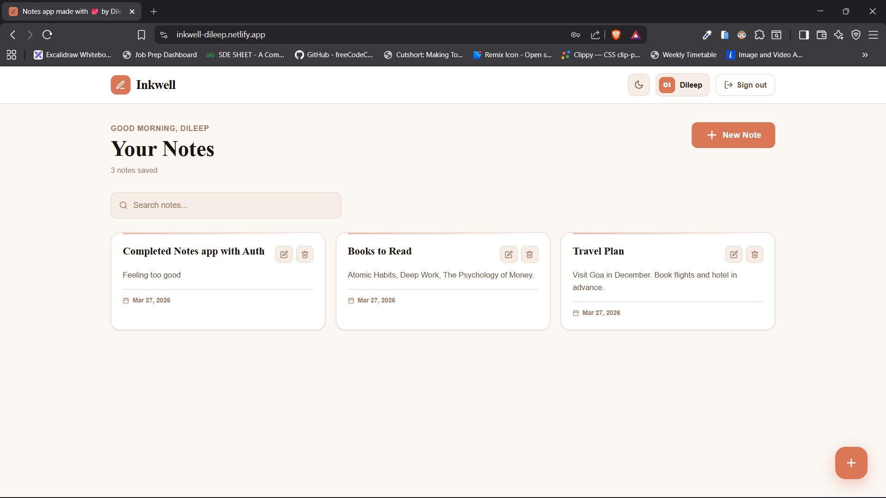
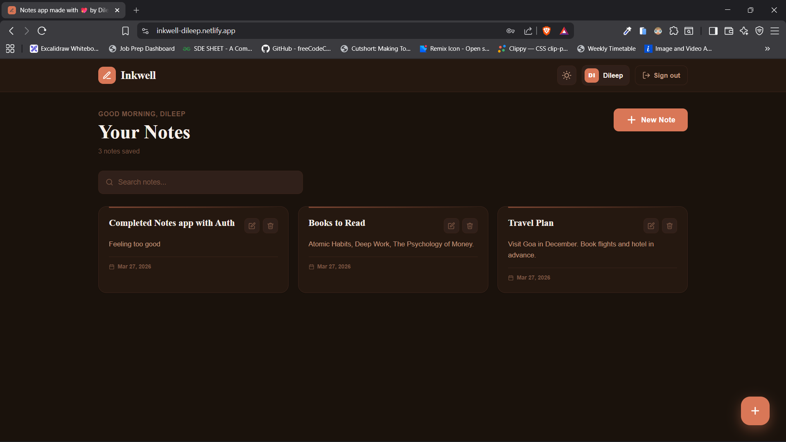
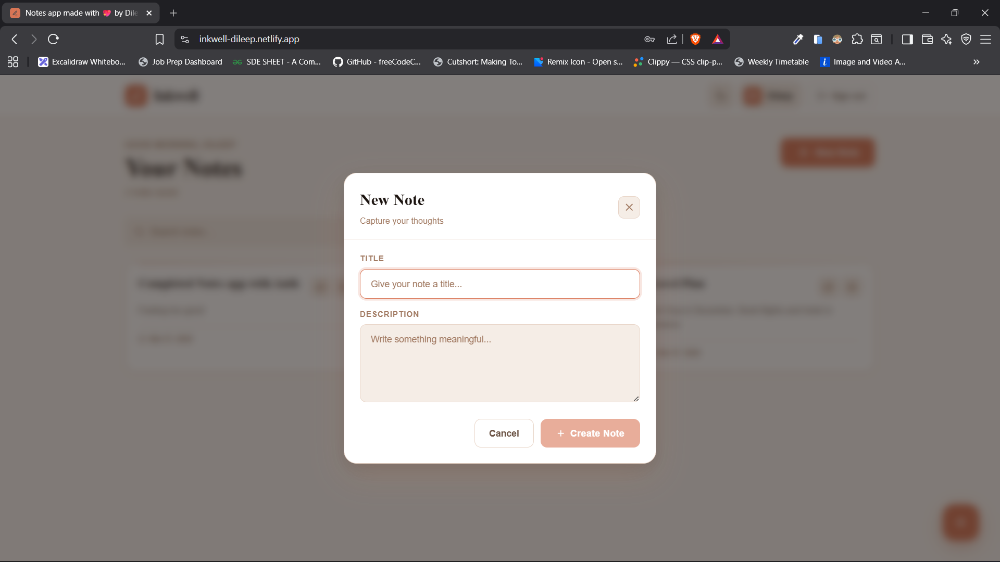
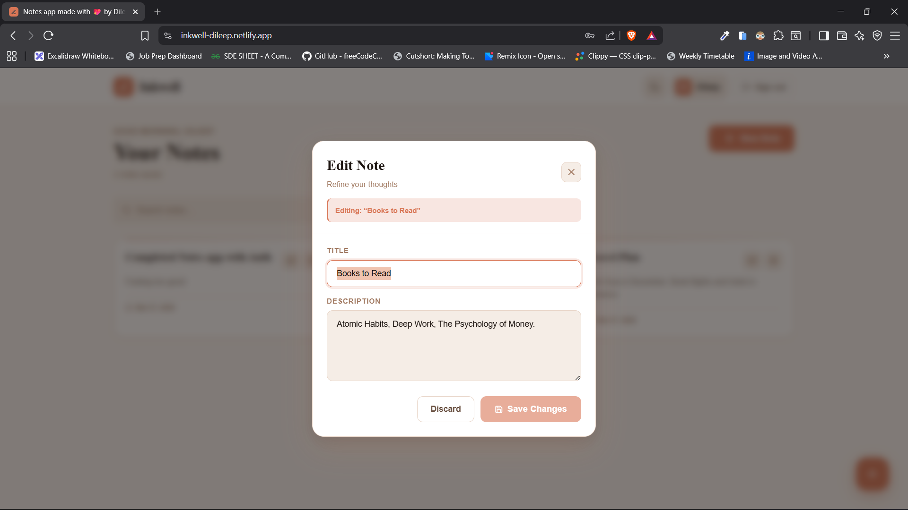

<div align="center">


# Inkwell - Notes App

**A clean, full-stack notes application with a warm terracotta aesthetic, dark/light mode, and smooth JWT-based auth.**

<br/>

[](https://inkwell-dileep.netlify.app/)
[](https://github.com/Dileep-kumawat/Notes-App-using-Auth.git)
[](./LICENSE)

<br/>



</div>

---

## ✨ Features

- 🔐 **Auth** - Register, login, and logout with secure HTTP-only JWT cookies
- 📝 **Full CRUD** - Create, read, update, and delete notes via modals
- 🌗 **Dark / Light Mode** - Persisted theme preference via `localStorage`
- 🔍 **Live Search** - Filter notes instantly by title or description
- 💀 **Skeleton Loading** - Polished loading states while data fetches
- 📱 **Responsive** - Works great on mobile, tablet, and desktop
- ⚡ **Optimistic UI** - Redux state updates immediately; no page refresh needed

---

## 🖼️ Screenshots

| Login | Register | Home (Light) |
|-------|----------|-------------|
|  |  |  |

| Home (Dark) | Create Note Modal | Edit Note Modal |
|-------------|------------------|----------------|
|  |  |  |


---

## 🛠️ Tech Stack

### Frontend


### Backend


---

## 📁 Folder Structure

```
inkwell/
│
├── Frontend/                        # React frontend (Vite)
│   ├── public/
│   └── src/
│       ├── app/
│       │   ├── AppRoutes.jsx      # Route definitions
│       │   └── store.js           # Redux store
│       └── features/
│           ├── auth/
│           │   ├── apis/          # auth.api.js
│           │   ├── components/    # ProtectedRoute.jsx
│           │   ├── hooks/         # useAuth.js
│           │   ├── pages/         # Login.jsx, Register.jsx
│           │   └── authSlice.js
│           ├── notes/
│           │   ├── apis/          # notes.api.js
│           │   ├── components/    # NoteCard, CreateNoteModal, UpdateNoteModal
│           │   ├── hooks/         # useNotes.js
│           │   ├── pages/         # Home.jsx
│           │   └── notesSlice.js
│           └── shared/
│               ├── context/       # ThemeContext.jsx
│               ├── components/    # Navbar.jsx
│               └── styles/        # main.css
│
└── Backend/                        # Express backend
    ├── config/
    │   └── database.js            # MongoDB connection
    ├── controllers/
    │   ├── auth.controller.js
    │   └── notes.controller.js
    ├── middlewares/
    │   └── auth.middleware.js     # JWT verification
    ├── models/
    │   ├── user.model.js
    │   └── note.model.js
    ├── routes/
    │   ├── auth.route.js
    │   └── notes.route.js
    ├── validators/
    │   └── auth.validator.js
    ├── src/app.js
    └── server.js
```

---

## 🔌 API Reference

### Auth — `/api/auth`

| Method | Endpoint | Access | Description |
|--------|----------|--------|-------------|
| `POST` | `/register` | Public | Create a new account |
| `POST` | `/login` | Public | Sign in and receive cookie |
| `GET` | `/logout` | Private | Clear session cookie |
| `GET` | `/get-me` | Private | Get current user details |

### Notes — `/api/notes`

| Method | Endpoint | Access | Description |
|--------|----------|--------|-------------|
| `GET` | `/` | Private | Fetch all notes for the user |
| `POST` | `/create` | Private | Create a new note |
| `PATCH` | `/:id` | Private | Update a note by ID |
| `DELETE` | `/:id` | Private | Delete a note by ID |

> All private routes require a valid JWT cookie (`token`) set at login.

---

## 🚀 Local Setup

### Prerequisites
- Node.js `v18+`
- MongoDB (local or [MongoDB Atlas](https://www.mongodb.com/cloud/atlas))

### 1. Clone the repo

```bash
git clone https://github.com/Dileep-kumawat/Notes-App-using-Auth.git
cd inkwell
```

### 2. Setup the Backend

```bash
cd Backend
npm install
```

Create a `.env` file in `/Backend`:

```env
PORT=3000
MONGO_URI=mongodb://localhost:27017/inkwell
JWT_SECRET=your_super_secret_key_here
FRONTEND_ENDPOINT=http://localhost:5173
```

Start the server:

```bash
npm run dev
```

### 3. Setup the Frontend

```bash
cd ../Frontend
npm install
```

Create a `.env` file in `/Frontend`:

```env
VITE_BACKEND_ENDPOINT=http://localhost:3000
```

Start the dev server:

```bash
npm run dev
```

### 4. Open in browser

```
http://localhost:5173
```

---

## 🌍 Deployment Notes

When deploying frontend and backend to **separate domains**, cookies require explicit configuration. Make sure your `res.cookie()` call uses:

```js
res.cookie("token", token, {
  httpOnly: true,   // blocks JS access
  secure: true,     // HTTPS only
  sameSite: "none", // required for cross-origin
  maxAge: 24 * 60 * 60 * 1000
});
```

And your CORS config must have `credentials: true` with the exact frontend origin.

---

## 📬 Contact

Have feedback, questions, or just want to connect?

| Platform | Link |
|----------|------|
| 📧 Email | [dileepkumawat525@gmail.com](mailto:dileepkumawat525@gmail.com) |
| 💼 LinkedIn | [linkedin.com/in/dileep-kumawat](https://www.linkedin.com/in/dileep-kumawat/) |
| 🐦 Twitter / X | [@dilsecode](https://x.com/dilsecode) |
| 🌐 Portfolio | [portfolio.dev](https://dileep3.netlify.app) |

---

## 📄 License

This project is licensed under the **MIT License** - see the [LICENSE](./LICENSE) file for details.

---

<div align="center">

Made with ♥ and a lot of ☕ by **[Dileep kumawat](https://dileep3.netlify.app)**

⭐ If you found this useful, consider giving it a star on GitHub!

</div>